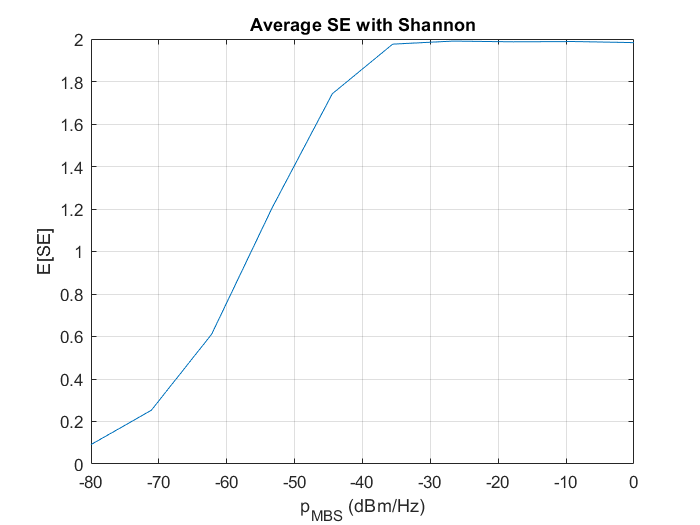
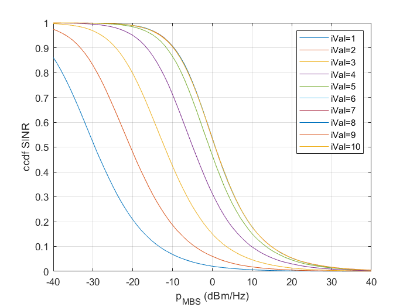
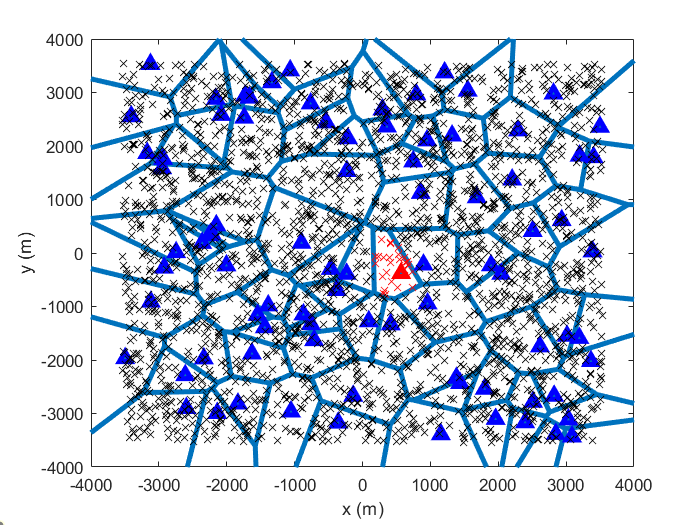

# Heterogeneous Networks Simulator
This MATLAB code models an abstracted simulator for the downlink (DL) of heterogeneous cellular networks (HCNs). The code considers two tiers of base stations (BSs), macro BS (MBs) and small cell BS (SBS) that are randomly placed according to a uniform Poisson point process (PPP). The spatial distribution of the mobile terminals (MTs) is also drawn from a PPP. 

The code draws a number of *spatial realizations*, `p.nReal`, to compute several performance metrics. For each realization, the code associates each MT to its serving BS according to a maximum DL receiver power criteria, and then it computes realizations of the KPIs for each MT. 

## SW version:
This code has been tested with MATLAB 2022b. It should also work in earlier versions but this has not been checked. 

## Key performance indicators (KPIs)
The following metrics are obtained for each MT and random realization:
1. Signal-to-noise plus interference ratio (SINR).
2. Shannon spectral efficiency (SE) in terms of bps/Hz
3. SE considering adaptive modulation and coding (AMC). The SINR thresholds and SE values associated with each modulation and coding scheme are taken from a 4G simulator. Those values are available in [1] (Table 2).

As KPIs, it is computed statistics about those random metrics including the complementary cumulative distribution function (ccdf) of the SINR and the average SE for Shannon and AMC. 

## Running a simulation
To run a simulation, you must run the script `scr_runSimulation.m`. The simulation parameters are initialized with the function `defaultParms.m` to get default values. You can modify each parameter value in the script `scr_runSimulation.m` after the call to `defaultParms.m`. The simulation parameters are stored in the structs, `p` and `vP`. The former structure contains those parameters that cannot be sweeped whereas the latter contains parameters that can be sweeped to obtain simulation results related to different values of the sweeped parameter. 

### Simulation sweeps
To draw figures showing a given KPIs versus a given system parameter you need to run a simulation sweep. To do that modify the parameter, `p.nVal` to represent the number of points in the simulation sweep. 

The parameter that you aim to sweep must be a field of the `vP` struct, and must be initialized as a vector whose length is equal to `p.nVal`.

## Results
For each simulation, a folder to save the results is created within a `Results` folder. The file `results.mat` stores all the KPIs and parameters related to the simulation. 
Besides, if the simulation has swept a given parameter, some figures are created that illustrate several KPIs versus the sweeped parameter. 

The following figures illustrate the average SE using Shannon and the ccdf of the SINR for a sweep of the transmit power spectral density between $-80$ to $0$ dBm/Hz.

## Location of BSs and MTs
The location of BSs and MTs as well as some indices indicating the association are stored in the struct `vR` that is stored in the `results.mat` file. Such a struct contains another struct, `loc` that is a cell array of cell arrays. The elements of the outer cell array refer to each of the simulations in a sweep, `iVal`. The inner cell array refers to each spatial realization related to a given iteration of the sweep, `iReal`. Thus, to access the locations of BSs and MTs for the first sweep iteration, `iVal = 1` and first spatial realization, `iReal = 1` you must write: `vR.loc{iVal}{iReal}`. 

This will give you a struct with the following fields:
1. `nBSs`: Number of BSs
2. `PhiBS`: Matrix of size $\rm{nBSs} \times 2$ that contains the cartesian coordinates $(x,y)$ of each BSs. The BSs are identified by the row that has its location in this matrix. Hence, the numerical identifier (NI), `ni`, of a BS placed at $(x_0, y_0)$ is the index of the row that has that location. 
3. `nMTs`: Number of MTs
4. `PhiMT`:  Matrix of size $\rm{nMTs} \times 2$ that contains the cartesian coordinates $(x,y)$ of each MTs. MTs are also identified by their NIs, `ni`. 
5. `asocBS2MT`: Cell array of length `nBSs` that contains the NIs of the MTs associated with a given BSs. Therefore for instance `asocBS2MT{4}` has a vector whose length is the number of MTs associated to the BS with $\rm{NI} = 4$. 
5. `asocMT2BS`: Vector that stores the NIs of the serving BS for each MT
6. `liProbeBSs`: Logical index of the probe BSs. To avoid border effects when obtaining the metrics only the probe BSs are used to obtain the metrics. Therefore, BSs close to the edges of the simulated area are excluded, and they are only used as a source of interference. 
7. `niProbeBSs`: NI of the probe BSs. 
8. `emptyBS`: Logical indexes for those BSs that do not serve any MT. 

You can draw the locations of the BSs and MTs and identify those MTs associated with the BS, niProbeBS, using this function `Code\Utilities\showLoc.m`.
To call that function, first load a `results.mat` folder, and inspect the variable `niProbeBSs` to check NIs of the probe BSs. You can do that by typing: `vR.loc{1}{1}.niProbeBSs`. Then, chose one of those probe BSs and type (to show probe BS $\rm{NI} = 25$): `[hf, loc_nUEs, loc_BS] = showLoc(vR.loc{1}{1}, 25, 'r')`.

That will show a figure like this one.

# REFERENCES
This simulator has been further extended in some works below to investigate different techniques for the DL and uplink of HCNs:  

[1] F. J. Martín-Vega, X. Xi, M. Di Renzo, et al. On muting mobile terminals for uplink interference mitigation in HetNets—system-level analysis via stochastic geometry. J Wireless Com Network 2019, 100 (2019).

[2] F. J. Martin-Vega, G. Gomez, M. C. Aguayo-Torres and M. Di Renzo, "Analytical Modeling of Interference Aware Power Control for the Uplink of Heterogeneous Cellular Networks," in IEEE Transactions on Wireless Communications, vol. 15, no. 10, pp. 6742-6757, Oct. 2016, doi: 10.1109/TWC.2016.2588469.

[3] F. J. Martin-Vega, I. M. Delgado-Luque, G. Gomez, M. C. Aguayo-Torres and J. T. Entrambasaguas, "Downlink power setting for energy efficient Heterogeneous Cellular Networks," 2016 8th International Congress on Ultra Modern Telecommunications and Control Systems and Workshops (ICUMT), Lisbon, Portugal, 2016.